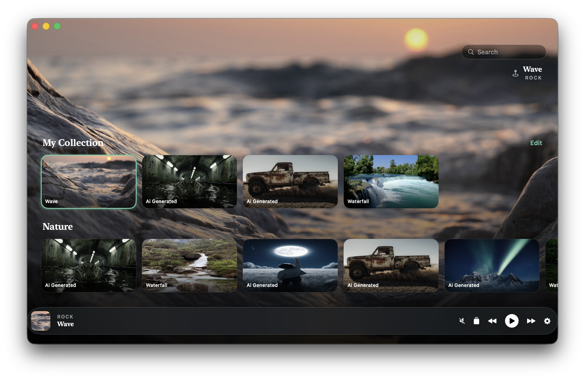

<p align="center">
  <a href="README.md">English</a> · <a href="README.ko.md">한국어</a> · <b>日本語</b> · <a href="README.zh-Hans.md">简体中文</a>
</p>

<p align="center">
  
</p>

# Canopy

[Pixabay](https://pixabay.com)の自然映像をループ再生し、実際のデスクトップ背景として表示するmacOSのメニューバーアプリです — スクリーンセーバーではなく、本物のライブ壁紙です。



## 主な機能

- **閲覧＆再生** — Nature/Backgrounds/Animals/Travelの棚とフリーテキスト検索。Pixabayのカタログを「Load More」でページ送りしながら閲覧できます
- **ディスプレイごとの壁紙** — 接続中のモニターごとに別々の動画を割り当てるか、**All**ですべてのディスプレイに一括適用できます
- **My Collection** — 再生した動画は自動的に保存されます。ドラッグ＆ドロップまたは移動ボタンで並び替え、ワンクリックで削除できます
- **正確なRetinaレンダリング** — デスクトップレベルのプレイヤーが各画面の実際の表示倍率に同期するため、4Kソース動画がアップスケールされずシャープに表示されます
- **バッテリーへの配慮** — 画面ロック/スリープ、低電力モード時は自動的に一時停止。バッテリー駆動中の一時停止もオプションで有効にできます
- **メニューバー操作** — ステータスアイコンをクリックするとOpen / Play–Pause / Quitメニューが表示されます。メイン画面は通常のタイトルバー付きウィンドウでサイズ変更も可能です（⌘Qで終了、Dockアイコンなし）
- **多言語対応** — English, 한국어, 日本語, 简体中文

## 動作環境

- macOS 13.0（Ventura）以降
- Xcode 15以降（ビルド時）
- 無料の[Pixabay APIキー](https://pixabay.com/api/docs/) — Canopyは共有キーを内蔵していないため、初回起動時に設定画面でご自身のキーを入力してください

## インストール

Homebrewでインストールできます — このリポジトリ自体がtap（タップ）を兼ねているため、別のtap用リポジトリは不要です:

```bash
brew tap mrKangHo/canopy https://github.com/mrKangHo/Canopy
brew install --cask canopy
```

配布ビルドはアドホック署名（Appleの公証なし）のため、初回起動時にGatekeeperが「開発元が未確認」としてブロックします。`/Applications`内の`Canopy.app`を右クリックし、**開く**を一度選択すれば、以降は問題なく起動できます。

新しいバージョンへの更新: `brew upgrade --cask canopy`

## ビルド方法

このプロジェクトは[XcodeGen](https://github.com/yonaskolb/XcodeGen)を使って`project.yml`から生成されます:

```bash
brew install xcodegen   # 初回のみ
xcodegen generate
open Canopy.xcodeproj
```

Xcodeでビルド＆実行（⌘R）してください。UI以外のレイヤーを素早く反復開発するための`Package.swift`も同梱していますが、実際に署名済みの`.app`（Info.plist、アセットカタログ、アプリアイコンを含む）を生成するのはXcodeGenプロジェクトの方です。

ソースファイルを追加・削除・リネームするたびに`xcodegen generate`を再実行してください — `.xcodeproj`は自動生成される成果物であり、手動編集する対象ではありません。

## プロジェクト構成

```
Sources/Canopy/
  App/            アプリのエントリーポイント + AppDelegate（ステータスアイテム、メニュー）
  MainWindow/      SwiftUI画面: ヒーローブラウズビュー、動画詳細、設定、棚
  Models/          WallpaperManager（アプリの状態）、DisplayInfo、CategorySection
  PixabayAPI/      ネットワーククライアント + レスポンスモデル
  Caching/         動画のローカルキャッシュ、検索結果キャッシュ
  WallpaperWindow/ 実際のデスクトップレベルAVPlayerウィンドウ（ディスプレイごとに1つ）
Resources/
  Assets.xcassets       アプリアイコン、ステータスバーアイコン
  Localizable.xcstrings String Catalog（en/ko/ja/zh-Hans）
docs/
  icon.png, screenshots/ このREADMEで使用する画像（アプリバンドルには含まれません）
Casks/
  canopy.rb              Homebrew Cask — このリポジトリを自身のtapとして機能させます
```

デスクトップ壁紙そのものは、各画面のFinderアイコンレイヤーのすぐ下に固定されたボーダーレスの`NSWindow`として描画されます（`WallpaperWindow/WallpaperWindowController.swift`）— システムのデスクトップピクチャAPIには一切触れないため、macOSがそのAPIの権限を段階的に厳しくしても影響を受けません。

## コンテンツとライセンス

動画コンテンツはPixabayからストリーミングされ、初回再生後にローカルへキャッシュされます。[Pixabayコンテンツライセンス](https://pixabay.com/service/license/)および[APIご利用規約](https://pixabay.com/api/docs/)に準拠しています（永続的なホットリンク禁止、検索結果は24時間キャッシュ、設定画面にクレジット表示）。

## 既知の制限事項

- Pixabay動画APIの上限は4K（3840×2160）です — このアプリに適した本物の無料8K映像ソースは現時点で存在しません。代替手段を検討中の方はリポジトリ内の関連する議論をご参照ください
- 配布ビルドはアドホック署名の状態です（このビルドの背後にApple Developer Programのメンバーシップはありません）。公証・サンドボックス化・Mac App Storeへの登録は行われていません — App Sandboxへ移行するには、デスクトップレベルのウィンドウ配置と現在のキャッシュ方式の調整が必要です
- `CGDirectDisplayID`に基づくディスプレイごとの記憶機能は、再接続・再起動時にベストエフォートで動作します（一般的な壁紙アプリと同水準であり、Appleによる保証はありません）
